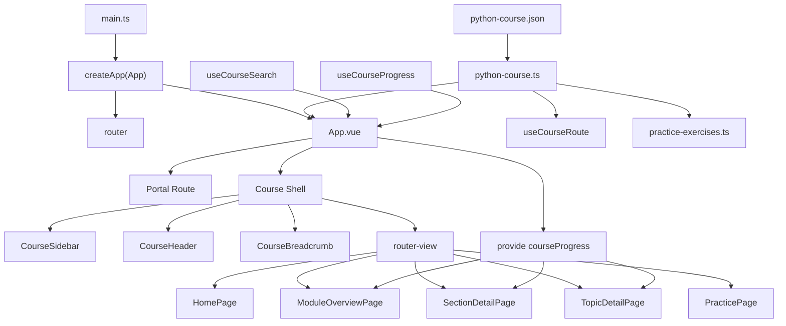
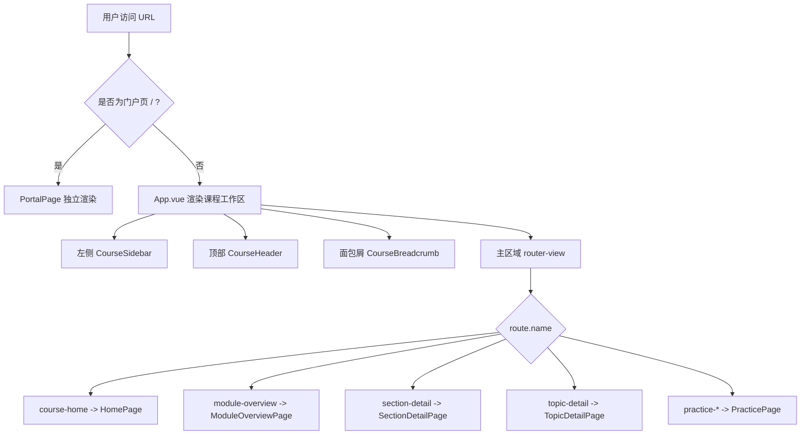
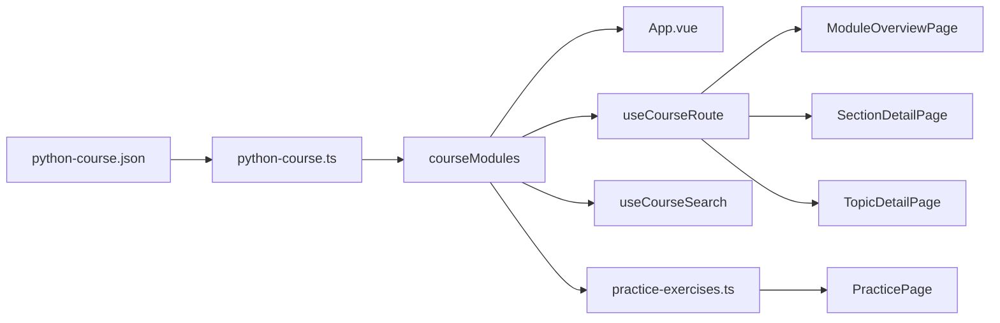
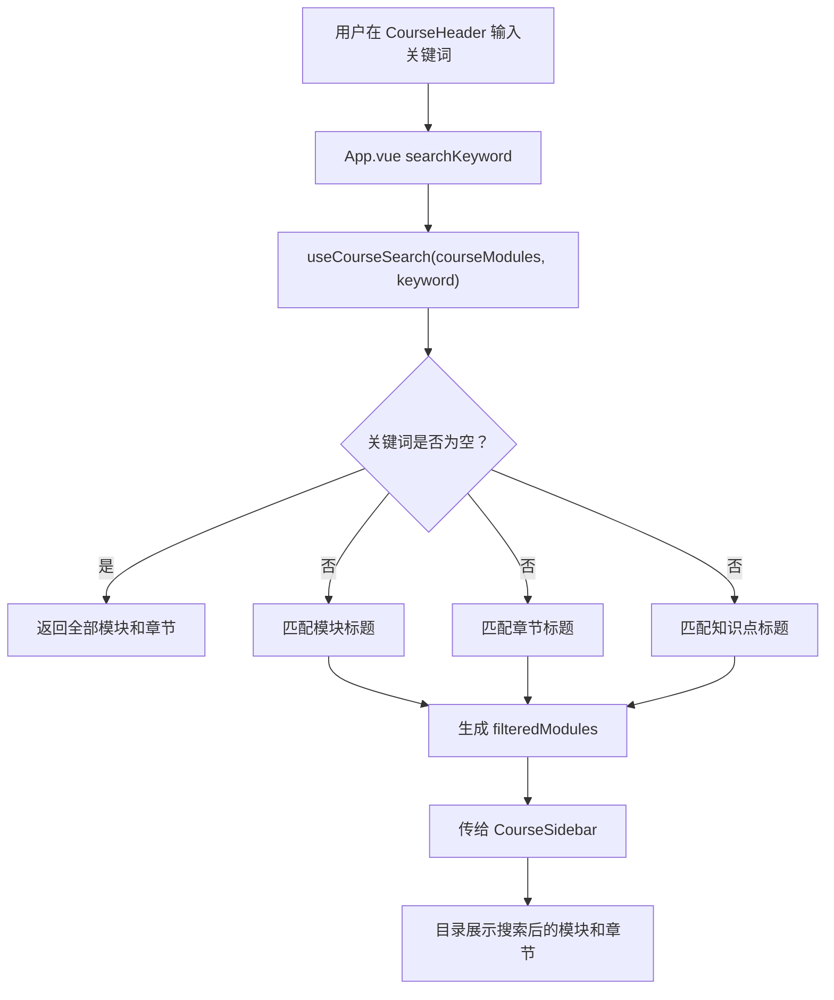
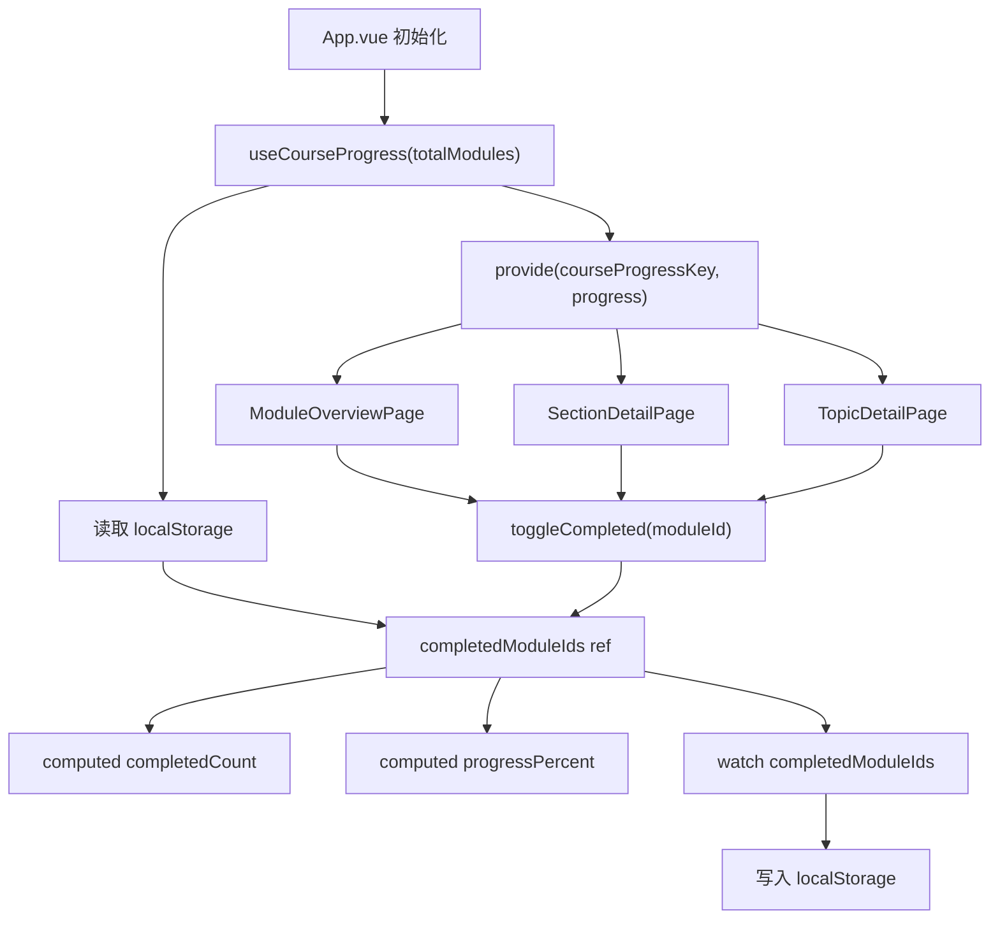
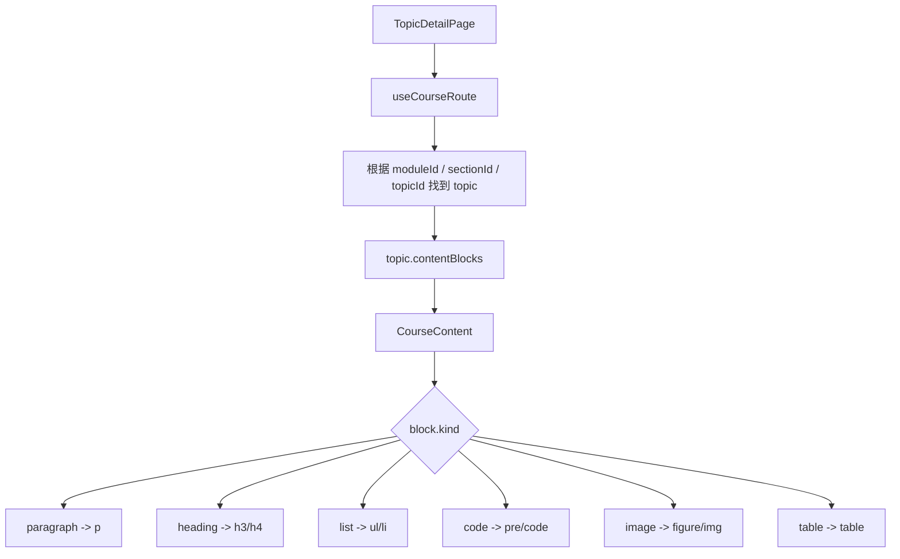
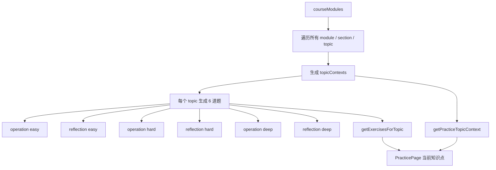
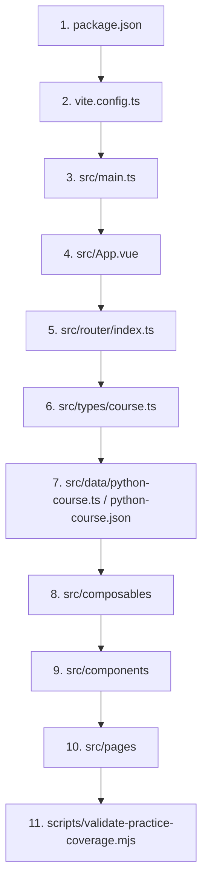

# AGENTSU 系统分析报告

## 1. 系统概览

AGENTSU 是一个面向 Python 初学者的课程学习站点，形态是纯前端教学仪表盘。系统将结构化课程数据渲染为可浏览、可搜索、可记录进度的学习工作台，并提供按知识点生成的自检练习。

核心能力：

- 展示 Python 课程的模块、章节、知识点三级结构
- 支持课程目录浏览、关键词搜索
- 支持模块学习进度本地记录
- 支持知识点详情页展示正文、代码、图片、表格
- 支持按知识点生成练习题与参考答案
- 通过 GitHub Pages 部署，基础路径为 `/AGENTSU/`

技术栈：

| 分类 | 技术 |
| --- | --- |
| 前端框架 | Vue 3 |
| 构建工具 | Vite |
| 开发语言 | TypeScript |
| 路由 | Vue Router |
| UI 组件 | Element Plus |
| 组件自动导入 | unplugin-auto-import、unplugin-vue-components |
| 部署形态 | GitHub Pages 静态站点 |

当前课程数据规模：

| 指标 | 数量 |
| --- | ---: |
| 课程模块 | 17 |
| 章节 | 106 |
| 知识点 | 343 |
| 内容块 | 2830 |
| 图片 | 130 |
| 表格 | 29 |
| 练习题 | 2058 |

## 2. 项目目录结构

```text
G:\AIx\AlPYTHON
├─ src
│  ├─ main.ts                     # 应用入口
│  ├─ App.vue                     # 全局应用壳、课程布局、搜索、进度注入
│  ├─ router\index.ts             # 路由定义
│  ├─ data
│  │  ├─ python-course.json       # 课程主数据
│  │  ├─ python-course.ts         # 课程数据导出
│  │  └─ practice-exercises.ts    # 练习题动态生成逻辑
│  ├─ types\course.ts             # 课程、内容块、练习题类型定义
│  ├─ composables
│  │  ├─ use-course-route.ts      # 从路由解析当前模块、章节、知识点
│  │  ├─ use-course-search.ts     # 课程搜索
│  │  └─ use-course-progress.ts   # localStorage 学习进度
│  ├─ components
│  │  ├─ course-sidebar.vue       # 左侧课程目录
│  │  ├─ course-header.vue        # 顶部搜索与进度
│  │  ├─ course-breadcrumb.vue    # 面包屑
│  │  ├─ course-content.vue       # 正文内容块渲染器
│  │  ├─ module-overview.vue      # 模块概览
│  │  └─ section-list.vue         # 章节列表
│  ├─ pages
│  │  ├─ portal-page.vue          # 门户页
│  │  ├─ home-page.vue            # 课程首页
│  │  ├─ module-overview-page.vue # 模块详情页
│  │  ├─ section-detail-page.vue  # 章节详情页
│  │  ├─ topic-detail-page.vue    # 知识点详情页
│  │  └─ practice-page.vue        # 知识点练习页
│  ├─ symbols
│  │  └─ course-progress.ts       # provide/inject key
│  └─ styles                      # 全局、布局、页面和内容样式
├─ public
│  └─ course-assets\images        # 课程图片资源
├─ scripts
│  └─ validate-practice-coverage.mjs
├─ vite.config.ts
├─ package.json
├─ README.md
└─ PRD.md
```

## 3. 启动、构建与部署

常用命令：

```bash
npm install
npm run dev
npm run build
npm run check:practice
npm run preview
```

脚本说明：

| 命令 | 作用 |
| --- | --- |
| `npm run dev` | 启动 Vite 本地开发服务 |
| `npm run build` | 先执行 `vue-tsc -b` 类型检查，再执行 Vite 构建 |
| `npm run check:practice` | 校验每个知识点是否生成完整练习题 |
| `npm run preview` | 预览生产构建结果 |

部署约束：

- `vite.config.ts` 中 `base` 固定为 `/AGENTSU/`
- `src/router/index.ts` 使用 `createWebHashHistory("/AGENTSU/")`
- 站点以静态资源形式部署到 GitHub Pages

## 4. 总体架构

系统是“静态课程数据 + 前端状态 + 路由驱动页面”的架构。没有后端服务、数据库、登录鉴权或远程 API。



核心职责：

- `main.ts`：创建 Vue 应用并挂载路由。
- `App.vue`：区分门户页和课程工作区，管理搜索关键词、移动端目录抽屉、学习进度 provider。
- `router/index.ts`：定义门户、课程首页、模块、章节、知识点、练习页路由。
- `python-course.json`：课程内容的主数据源。
- `use-course-progress.ts`：学习进度本地持久化。
- `use-course-search.ts`：目录搜索过滤。
- `use-course-route.ts`：从当前路由参数解析课程上下文。

## 5. 路由详设

路由定义集中在 `src/router/index.ts`。

| 路径 | 页面 | 说明 |
| --- | --- | --- |
| `/` | `PortalPage` | 门户页 |
| `/course` | `HomePage` | 课程首页 |
| `/practice` | `PracticePage` | 练习首页 |
| `/practice/modules/:moduleId/sections/:sectionId/topics/:topicId` | `PracticePage` | 指定知识点练习 |
| `/modules/:moduleId` | `ModuleOverviewPage` | 模块概览 |
| `/modules/:moduleId/sections/:sectionId` | `SectionDetailPage` | 章节详情 |
| `/modules/:moduleId/sections/:sectionId/topics/:topicId` | `TopicDetailPage` | 知识点详情 |
| `/:pathMatch(.*)*` | redirect `/` | 兜底跳转 |

路由渲染流程：



## 6. 数据模型详设

核心类型定义在 `src/types/course.ts`。

课程结构：

```ts
export type Difficulty = "beginner" | "intermediate" | "advanced";

export interface CourseModule {
  id: string;
  title: string;
  summary: string;
  difficulty: Difficulty;
  estimatedMinutes: number;
  sections: CourseSection[];
}

export interface CourseSection {
  id: string;
  title: string;
  topics: CourseTopic[];
}

export interface CourseTopic {
  id: string;
  title: string;
  summary: string;
  contentBlocks: CourseContentBlock[];
}
```

正文内容块：

```ts
export type CourseContentBlock =
  | CourseParagraphBlock
  | CourseHeadingBlock
  | CourseListBlock
  | CourseCodeBlock
  | CourseImageBlock
  | CourseTableBlock;
```

内容块类型说明：

| 类型 | 说明 | 渲染方式 |
| --- | --- | --- |
| `paragraph` | 普通段落 | `<p>` |
| `heading` | 小标题 | `<h3>` 或 `<h4>` |
| `list` | 列表 | `<ul><li>` |
| `code` | 代码块 | `<pre><code>` |
| `image` | 图片 | `<figure>` |
| `table` | 表格 | `<table>` |

练习题结构：

```ts
export type ExerciseKind = "operation" | "reflection";
export type ExerciseDifficulty = "easy" | "hard" | "deep";

export interface CourseExercise {
  id: string;
  topicId: string;
  kind: ExerciseKind;
  difficulty: ExerciseDifficulty;
  prompt: string;
  answer: string;
}
```

## 7. 课程数据流

课程主数据来自 `src/data/python-course.json`，经 `src/data/python-course.ts` 导出为 `courseModules`。



关键规则：

- 页面层不维护独立课程副本。
- 课程详情页通过路由参数定位当前模块、章节、知识点。
- 练习页复用同一份课程数据生成题目上下文。
- `python-course.json` 是课程内容维护时最重要的数据入口。

## 8. 搜索流程

搜索逻辑位于 `src/composables/use-course-search.ts`，由 `App.vue` 持有关键词并将过滤后的模块传给目录组件。



当前搜索范围：

- 模块标题
- 章节标题
- 知识点标题

当前不搜索：

- 正文段落
- 代码内容
- 图片 alt
- 表格内容

## 9. 学习进度流程

学习进度逻辑位于 `src/composables/use-course-progress.ts`，通过 `localStorage` 持久化，并通过 `provide/inject` 被多个页面共享。



持久化 key：

```text
python-course-completed-modules
```

容错策略：

- 读取 `localStorage` 失败时返回空数组。
- 写入 `localStorage` 失败时静默降级。
- 即使浏览器禁用本地存储，课程基础浏览能力仍可用。

## 10. 知识点内容渲染流程

知识点详情页由 `TopicDetailPage` 根据当前路由找到 `topic`，再交给 `CourseContent` 渲染正文内容块。



图片路径处理使用 `import.meta.env.BASE_URL` 拼接资源路径，以适配 GitHub Pages 的 `/AGENTSU/` 基础路径。

```ts
const imageSrc = (src: string) => `${import.meta.env.BASE_URL}${src}`;
```

## 11. 练习题生成流程

练习题逻辑位于 `src/data/practice-exercises.ts`。练习题不是独立静态 JSON，而是基于课程知识点动态生成。



每个知识点固定生成 6 道题：

| 题型 | 难度 |
| --- | --- |
| `operation` | `easy` |
| `reflection` | `easy` |
| `operation` | `hard` |
| `reflection` | `hard` |
| `operation` | `deep` |
| `reflection` | `deep` |

覆盖校验脚本：

```bash
npm run check:practice
```

该脚本会遍历全部知识点，确认每个知识点都有完整的 6 道练习题。

## 12. 组件职责说明

| 文件 | 职责 |
| --- | --- |
| `src/App.vue` | 应用壳；区分门户页和课程页；管理搜索关键词、移动端抽屉、进度 provider |
| `src/components/course-sidebar.vue` | 课程目录；模块和章节导航；完成状态展示 |
| `src/components/course-header.vue` | 顶部标题、搜索框、总进度 |
| `src/components/course-breadcrumb.vue` | 根据路由展示面包屑 |
| `src/components/module-overview.vue` | 模块摘要、难度、时长、完成按钮 |
| `src/components/section-list.vue` | 模块下章节与知识点入口 |
| `src/components/course-content.vue` | 统一渲染正文内容块 |
| `src/pages/portal-page.vue` | 门户页，不展示课程侧栏、课程头部和面包屑 |
| `src/pages/home-page.vue` | 课程首页 |
| `src/pages/module-overview-page.vue` | 模块详情页，组合模块概览和章节列表 |
| `src/pages/section-detail-page.vue` | 章节详情页，展示知识点卡片 |
| `src/pages/topic-detail-page.vue` | 知识点详情页，展示正文内容块 |
| `src/pages/practice-page.vue` | 练习目录选择、题目展示、答案折叠 |

## 13. 新开发者阅读路径

建议按以下顺序理解系统：



快速理解重点：

1. 页面由路由驱动。
2. 课程内容来自本地静态 JSON。
3. 搜索和进度是前端状态。
4. 进度通过 `localStorage` 持久化。
5. 练习题由课程知识点动态生成。

## 14. 当前工程注意事项

- 项目没有后端、数据库、鉴权和 API 层。
- 课程数据维护的主入口是 `src/data/python-course.json`。
- 修改课程知识点后，应运行 `npm run check:practice` 检查练习覆盖。
- 修改构建或部署路径时，需要同时关注 `vite.config.ts` 的 `base` 和 router hash history base。
- 源码约束要求 `src` 下 `.vue`、`.ts`、`.css` 文件尽量保持在 300 行以内。
- 当前报告不修复已有中文乱码或编码显示问题，只描述当前仓库结构和系统设计。

## 15. 验收清单

文档变更验收：

- `REPORT.md` 位于项目根目录。
- Markdown 标题层级清晰。
- 表格、代码块和 Mermaid 图语法完整。
- 报告中的路由、命令、数据流、组件职责与当前仓库一致。

功能变更后的建议验收：

- 执行 `npm run check:practice`。
- 执行 `npm run build`。
- 检查 `/` 门户页是否正常。
- 检查 `/course` 课程首页是否正常。
- 检查模块、章节、知识点跳转是否正常。
- 检查搜索是否能过滤目录。
- 检查完成状态刷新后是否保留。
- 检查 `/practice` 是否能切换模块、章节、知识点。
- 检查图片、表格、代码块是否正常渲染。
- 检查移动端抽屉目录是否可用。

## 16. 总结

AGENTSU 的主线非常清晰：静态课程数据进入 Vue 应用，通过路由定位当前学习页面，通过 composables 处理搜索、进度和课程上下文，最后由页面组件和通用组件渲染成课程学习工作台。

新开发者接手时，应优先理解 `App.vue`、`router/index.ts`、`types/course.ts`、`python-course.json` 和三个 composable。理解这几处后，再进入具体页面和样式文件，整体维护成本会低很多。
